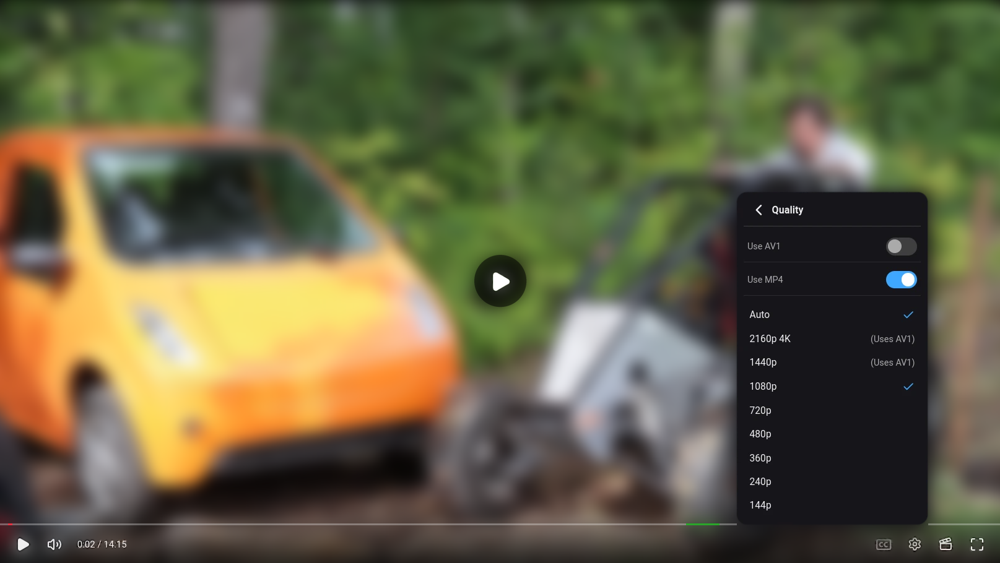
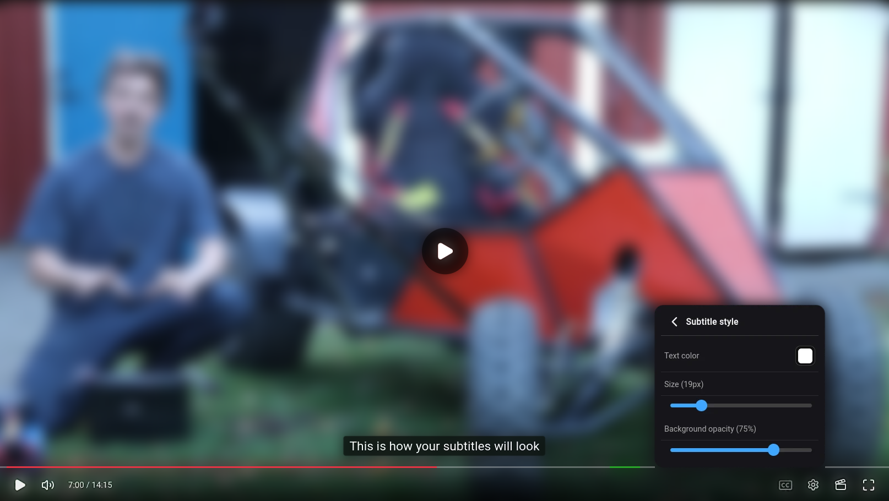

<div align="center">
  
  <h1>YT Zero</h1>
  <p><strong>A self-hosted YouTube inbox for people who want subscriptions, not recommendations.</strong></p>
  <p>
    <a href="LICENSE"></a>
  </p>
</div>

This is a personal fork of [Pelski/ytzero](https://github.com/Pelski/ytzero) (upstream). A first release exists (see [Releases](https://github.com/Fogbench/ytzero/releases)); no support or further releases are promised for now, and that may change. For everything this README does not cover (features, settings, authentication, TubeArchivist, public sharing, child profiles and more), see upstream and its [wiki](https://github.com/Pelski/ytzero/wiki) (upstream). This fork has upgraded every dependency to its latest major version (React 19, react-router 8, vite 8, TypeScript 7 and more); see [Security and upgrades](#security-and-upgrades). All credit for YT Zero itself goes to Pelski and the contributors listed at https://github.com/Pelski/ytzero/

## What this fork adds



<p align="center">
  
</p>

### Direct player

The direct player is the default. It streams the video from YouTube through your own server with yt-dlp, saves nothing to disk, and plays it in YT Zero's own controls. The YouTube embed stays available (**Downloads > Configuration > Default player**) for those who prefer it. If your audio keeps muting on new videos, that is a browser permission.

The gear menu holds:

- **Autoplay**, which continues through lists and falls back to "More like this" when there is no queue.
- **SponsorBlock** switch. A segment you deliberately seek into is not skipped.
- **Stable volume** and **Voice boost**, done with your browser's audio engine (nothing is re-encoded).
- **Audio track**, to switch the language of dubbed videos without losing your position.
- **Sleep timer** from 5 to 60 minutes, or at the end of the video.
- **Playback speed** slider from 0.25x to 2x in 0.05 steps.
- **Subtitles**, with language and style (size, colour, background, live sample). The CC button switches captions on and off.
- **Quality** up to 4K. Pick your preferred height or Auto, and choose AV1 or H.264. The list only offers what your browser can decode. Auto picks AV1 only when your browser can play it smoothly; when no quality plays smoothly, Auto uses the server's default stream.

If direct playback fails, the player never falls back to the embed silently. You get an explanation, a YouTube link and a button to use the embed if you want.

### Settings

- Hide "Continue watching" (Settings > Experience > Navigation).
- Hide the player's Download, Screenshot and Picture-in-picture buttons (Settings > Experience > Playback).
- Auto-generated captions mode (Settings > Experience > Subtitles): show them, use them only when the uploader made none, or hide them.

All of these are shown by default and can be switched off per profile. Every new string is translated into the nine UI languages.

## Install from the release (Linux)

Each release has a ready-to-run package, `ytzero-<version>.tar.gz`, with its `.sha256` file, on the [Releases page](https://github.com/Fogbench/ytzero/releases). Nothing needs compiling. Versions are named by date, `YYYY.MM.N` (for example `2026.10.1`).

```bash
sha256sum -c ytzero-<version>.tar.gz.sha256    # must print OK
tar -xzf ytzero-<version>.tar.gz && cd ytzero-<version>
bash install-linux.sh    # once; asks which port to use (default 3001)
bash start.sh            # prints the address to open
```

- Self contained, everything stays inside that folder: nothing is written to your home directory or the rest of the system. Your data is in `./data`; keep it backed up.
- The app starts empty; add channels from **Settings > Channels**.
- `bash update.sh` moves to the newest release (`--check` only looks). It backs up your data to `./backups` first.
- `bash uninstall.sh` removes what the installer added and keeps your data unless you pass `--remove-data`.
- The package installs pinned versions of Bun, yt-dlp, Deno and ffmpeg into `./bin` and ignores copies on your `PATH`.
- Needs `curl`, `xz` and `unzip` or `python3`. Without yt-dlp the app still runs and uses the YouTube embed.
- Tested: Linux x86_64, the automated install/update/uninstall test on a Proxmox container. macOS has no installer; `README.txt` inside the package lists the manual steps.

## Run from source

For development, or if you do not want the package. Run it natively with [Bun](https://bun.sh). On Linux (x86_64, aarch64), `bun run setup` installs the dependencies and downloads yt-dlp, Deno and ffmpeg into `./bin` when they are not already on your `PATH` (needs `curl`, `xz` and `unzip` or `python3`). On macOS, install them yourself, for example with Homebrew. Without yt-dlp the app still runs and uses the YouTube embed.

```bash
git clone https://github.com/Fogbench/ytzero && cd ytzero
bun run setup
bun run start   # http://localhost:3001, data in ./data
```

The app starts empty; add channels from **Settings > Channels**. Keep `./data` backed up. Environment variables are listed in [Configuration](https://github.com/Pelski/ytzero/wiki/Configuration) (upstream).

## Known limits

- The direct player depends on yt-dlp keeping up with YouTube.
- Two tabs playing the same video at different qualities replace each other's stream.
- Stable volume and Voice boost only work in the direct player.
- Tested on a MacBook with an M1 and on CachyOS (Arch Linux, KDE Plasma on Wayland) 2026-10-04.

  | Browser | Result |
  | --- | --- |
  | Firefox | Everything works, including HDR. |
  | Chrome | Everything works, including HDR. |
  | Safari | Plays up to 1080p (H.264 only, no AV1, no HDR). Stable volume and Voice boost have no effect. |

  Safari plays HLS with its built-in player, which does not let the page change the audio. The M1 has no AV1 decoder, and YouTube's H.264 stops at 1080p. VP9 is not supported by the direct player.
- Upstream's tvOS app and browser extension are not part of this fork.

## Documentation

General documentation is in the [upstream wiki](https://github.com/Pelski/ytzero/wiki) (upstream). Where it differs from this README (Docker and cloud installs, yt-dlp being optional), this README is correct for the fork.

In this repository: [Audio mode](docs/audio-mode.md), [Direct streaming research](docs/direct-streaming-research.md), [Public sharing](docs/public-sharing.md), [Backup and restore architecture](docs/backup-restore-architecture.md) and [Localization](docs/localization.md).

## Security and upgrades

On 2026-10-04 `bun audit` listed **42 known advisories** for the dependency versions at the time of forking (12 in `app/`, 30 in `ui/`). `bun audit` now reports **0**.

| Package | At fork (upstream) | Now (this fork) |
| --- | --- | --- |
| hono (server) | 4.12.25 | 4.13.13 |
| fast-xml-parser (server) | 5.9.3 | 5.11.2 |
| @simplewebauthn/server | 13.3.2 | 14.0.3 |
| @simplewebauthn/browser | 13.3.0 | 14.0.0 |
| openid-client | 6.8.4 | 6.8.8 |
| sharp | 0.35.4 | 0.35.5 |
| react, react-dom | 18.3.1 | 19.3.0 |
| react-router | 6.30.4 | 8.4.0 |
| vite | 6.4.3 | 8.3.2 |
| @vitejs/plugin-react | 4.7.0 | 6.1.1 |
| typescript | 5.9.3 | 7.0.2 |
| hls.js | 1.6.16 | 1.7.3 |
| emoji-picker-react | 4.19.1 | 4.22.3 |
| lucide-react | 1.18.0 | 1.52.0 |


## License

Licensed under the **GNU Affero General Public License v3.0 only** (`AGPL-3.0-only`). See [LICENSE](LICENSE).

YouTube is a trademark of Google LLC. This project is not affiliated with, endorsed by, or associated with YouTube or Google LLC.

## Thanks
To all contributors and special thanks to https://github.com/Pelski for this fantastic application.

## Development note

AI-assisted coding tools have been used moderately. Project direction, architectural decisions, validation, and responsibility for the final code remain with the author of this fork.

<div align="center">
  
</div>
